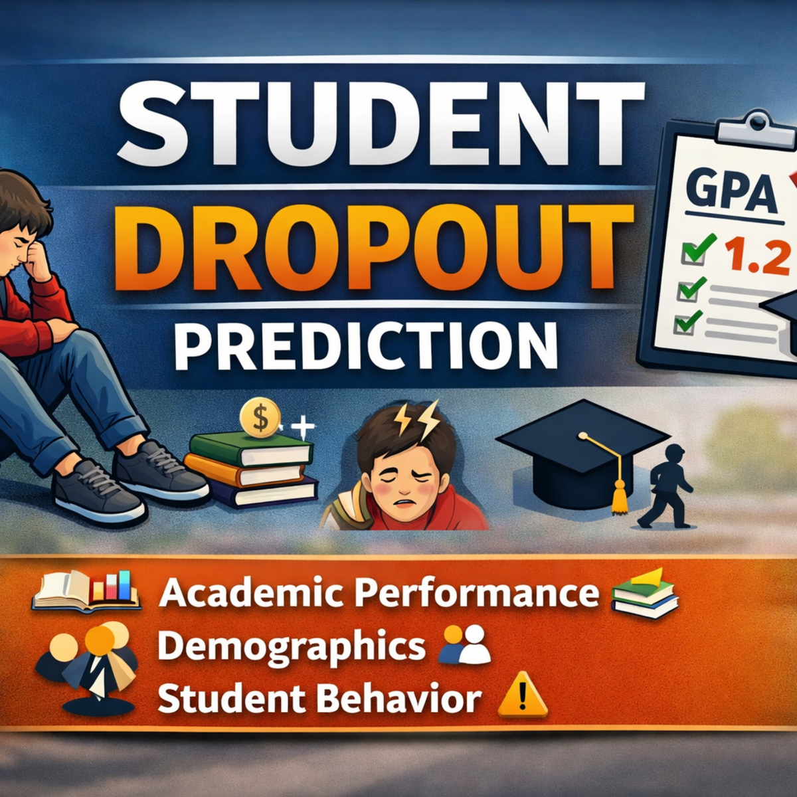

# 📦 Project_3 - Supervised Machine Learning

  

### **Student Dropout Behavior Predicted via Supervised Machine Learning Models **

**Participants:**
Aikaterini Lama
Manos Polydoros
Themis Mamatsopoulos

---

## 📁 1. Dataset

The dataset used for this project can be downloaded from Kaggle:

🔗 **Student Dropout Prediction**
[https://www.kaggle.com/datasets/meharshanali/student-dropout-prediction-dataset](https://www.kaggle.com/datasets/meharshanali/student-dropout-prediction-dataset
)

Stored in the repository under:
**`/data`**

---

## 🧹 2. Data Cleaning

Data cleaning was applied using:
* **`Data_Cleaning.ipynb`**

Stored in the directory:
**`/cleaning`**
---

## 📊 3. Exploratory Data Analysis (EDA)

EDA is conducted using:

* **`Data_Analysis.ipynb`**

Stored in the directory:
**`/analysis`**

---

## 📊 4. Modeling

Modeling was applied using:

* **`Data_Modeling.ipynb`**

Stored in the directory:
**`/modeling`**

---

## 📝 5. Results

Results are presented in the powerpoint file Students DropOut Prediction.pptx

Saved under:
**`/presentation`**

